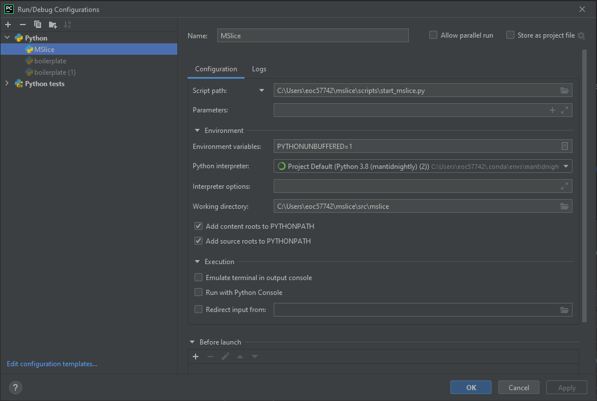

# Mantid MSlice

## Build status

[](https://coveralls.io/github/mantidproject/mslice?branch=main)

## Overview

MSlice is a tool for performing slices and cuts of multi-dimensional data produced by
[Mantid](http://www.mantidproject.org).

## Documentation

The current MSlice documentation can be viewed at

http://mantidproject.github.io/mslice

## Development

The following setup steps are required regardless of the environment:

* install mantid from either http://download.mantidproject.org or yum/apt repositories (nightly on Linux)
* clone this repository

### Command Line

To develop purely on the command line then simply use your favourite editor and run either

* `mslicedevel.bat` (Windows) or
* `./mslicedevel.sh` (Linux)

Please note that you may have to update the path to your Mantid installation in the file first if you are not using a Mantid conda environment.
For `mslicedevel.bat` one option is to set the path to your conda installation in 'CONDAPATH' and then simply run the batch file by double-clicking on it.

### PyCharm

Mantid must be installed prior to running this setup.

To set up the [PyCharm IDE](https://www.jetbrains.com/pycharm/) first open PyCharm and select `File->Open Project`. Select the cloned `mslice` directory and select open.
The project layout should be displayed. The first run may take some time to open while PyCharm parses the structure.

You will also need to edit the run configurations:  



- The startup script is `start_mslice.py`.
- The `bin` directory of an installed version of Mantid must be on the `PATH`.
- Set the environment variable `QT_QPA_PLATFORM_PLUGIN_PATH` to the directory with the QT plugins from the Mantid installation `MantidInstall/plugins/qt5`.
- If you're developing on Windows, the Python interpreter used must be the one shipped with the Mantid installation `MantidInstall/bin/python.exe`.
- If you're developing on Ubuntu, set the Python Interpreter path to `/usr/bin/python3.6`

You can now also develop MSlice using a Mantid conda environment.
First install Mantid using `conda env create -f mslice-developer.yml`,
then add this interpreter by going to the `File->Settings` in PyCharm, then `Project: mslice -> Python Interpreter`,
click the cog on the right side to add an existing interpreter and select `Conda` and `Python 3.8 (mantidnightly)`.
Then go to `Run -> Edit Configurations` and create new configuration with this interpreter.
Specify `start_mslice.py` as the startup script.

Optionally, you can also install pre-commit locally to ensure formatting issues are resolved when committing:

```sh
pre-commit install
```

### Running tests

To run the unit tests in the MSlice repository, you can run them from PyCharm or from the command line.

To run them from PyCharm, create a `pytest` configuration and specify the `Target` as `Custom`. Enter the following configuration:

- `Additional Arguments` can be left empty to run all tests, or you can specify a test name.
- `Python Interpreter` should be your `mantidnightly` python executable
- `Working directory` should be the root of your Mslice repository

To run them from the command line, make sure you have your conda developer environment active, and cd to the root of this repository. You can then run a test using the following command:

```sh
pytest <test_name>
```

To check the coverage of all the tests in MSlice, you can run the following commands:

```sh
coverage run -m pytest
coverage report
```

### Nightly conda build

Every night the MSlice unit tests are run [automatically](https://github.com/mantidproject/mslice/actions/workflows/unit_tests_nighly.yml) using the latest nightly conda
packages for mantid and mantidqt, as well as the ``main`` branch of MSlice. If the unit tests run successfully, and if changes have been made to the ``main`` MSlice branch within
the last 24 hours, a new MSlice conda package labelled ``nightly`` is created and uploaded to the [mantid conda channel](https://anaconda.org/mantid/mslice).
