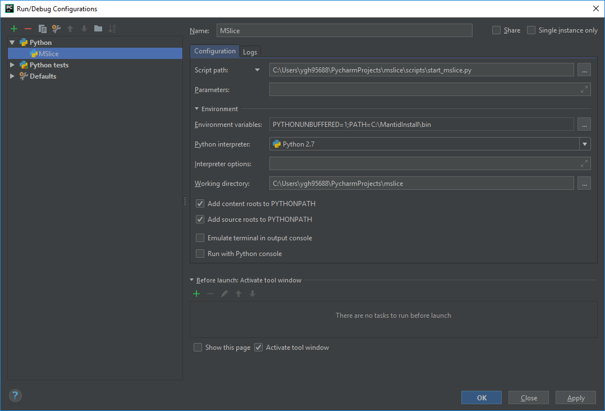

# Mantid MSlice

## Build status

## Overview

Mantid is a tool for performing slices and cuts of multi-dmensional data produced by
[Mantid](http://www.mantidproject.org).

## Documentation

The current MSlice documentation can be viewed at

http://mantidproject.github.io/mslice

## Development

The following setup steps are required regardless of the environment:

* install mantid from either http://download.mantidproject.org or yum/apt repositories (nightly on Linux)
* clone this repository

### Command Line

To develop purely on the command line then simply use your favourite editor and run either

* `mslicedevel.bat` (Windows) or
* `./mslicedevel` (Linux)

### PyCharm

Mantid must be installed prior to running this setup.

To set up the [PyCharm IDE](https://www.jetbrains.com/pycharm/) first open PyCharm and select `File->Open Project`. Select the cloned `mslice` directory and select open.
The project layout should be displayed. The first run may take some time to open while PyCharm parses the structure.

You will also need to edit the run configurations:  

- The startup script is `start_mslice.py`.
- The `bin` directory of an installed version of Mantid must be on the `PATH`.
- If you're developing on Windows, the Python interpreter used must be the one shipped with the Mantid installation `MantidInstall/bin/python.exe`.
- If you're developing on Ubuntu, set the Python Interpreter path to `/usr/bin/python2.7`
