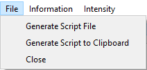

Command Line Interface
======================

Generating scripts
------------------

Each MSlice plot window has an option in the ``File`` menu to generate a script that would reproduce the plot. This will include the
full history of the workspace which provides the data for the plot, and additionally any graphical changes to the plot above the
default (e.g. if the axes titles or limits have been changed or additional information such as recoil or Bragg lines added). The
script can either be written to a file or copied to the clipboard.

Generated scripts may be run from the MantidWorkbench script window.

Alternatively, when written to a file the script can also be run from the IPython console in the MSlice GUI using the ``import``
directive and the ``reload`` (``importlib.reload`` in Python 3) function. For example, the first time the script is run, do:

.. code:: python

    import script_name

for a script file named ``script_name.py`` which is on the Python path. Subsequently, if you change the script file and want to re-run it,
you can do:

.. code:: python

    reload(script_name)

Plotting using Matplotlib interface
-----------------------------------

Whilst MSlice uses Matplotlib to render all the plots, it has its own type of figure windows in order to accommodate additional
features such as the keep / make current functionality and interactive plots. The MSlice specific figures *do not* support multiple
plots per figure (subplots) and will not work in a Jupyter notebook. However, MSlice is also able to plot to a generic Matplotlib
figure.

To plot a 1D cut using the MSlice figures use:

.. code:: python

    import mslice.cli as mc
    import mslice.plotting.pyplot as plt

    ws = mc.Load('data.nxspe')
    cut_ws = mc.Cut(ws, '|Q|', 'DeltaE, -1, 1')

    fig = plt.figure()
    ax = fig.add_subplot(111, projection='mslice')
    ax.errorbar(cut_ws, fmt='ok')
    ax.set_ylim(0., 0.1)

    mc.Show()

To plot the same cut using a plain Matplotlib figure use:

.. code:: python

    import mslice.cli as mc
    import matplotlib.pyplot as plt

    ws = mc.Load('data.nxspe')
    cut_ws = mc.Cut(ws, '|Q|', 'DeltaE, -1, 1')

    fig = plt.figure()
    ax = fig.add_subplot(111, projection='mslice')
    ax.errorbar(cut_ws, fmt='ok')
    ax.set_ylim(0., 0.1)

    fig.show()

E.g. the only difference is that you must use the ``matplotlib.pyplot`` package instead of the ``mslice.plotting.pyplot`` package
and call ``fig.show()`` at the end instead of ``mc.Show()``. In both cases, all the standard object-oriented Matplotlib functions
(such as ``set_title``, ``set_xlabel``, ``set_xlim`` etc.) are accepted. Note that also in both cases you must specify the
``projection='mslice'`` keyword argument to ``add_subplot``, because this lets the Matplotlib ``errorbar`` function recognise an
MSlice workspace. Finally, please also that the MSlice override of ``pyplot`` *does not* support the ``fig, ax = plt.subplots()``
syntax.

You must also use ``errorbar`` to plot a 1D cut, and ``pcolormesh`` to plot a 2D slice. No other Matplotlib plotting function are
aware of MSlice workspaces (even with the ``projection='mslice'`` argument).

An example of plotting a slice:

.. code:: python

    import mslice.cli as mc
    import matplotlib.pyplot as plt

    ws = mc.Load('data.nxspe')
    slice_ws = mc.Slice(ws, '|Q|, 0, 10, 0.01', 'DeltaE, -5, 55, 0.5')

    fig = plt.figure()
    ax = fig.add_subplot(111, projection='mslice')
    mesh = ax.pcolormesh(slice_ws, cmap='coolwarm')
    mesh.set_clim(0, 1)
    cb = plt.colorbar(mesh, ax=ax)

    fig.show()

Plotting using MSlice specific commands
---------------------------------------

In addition to using the Matplotlib-style object-oriented interface (defining a ``figure`` and then ``add_subplot``), there are
also MSlice functions which will wrap these commands and plot to an MSlice figure (e.g. does not work in Jupyter, does not support
multiple subplots, but has all the GUI tools (overplot recoil lines / Bragg peaks, interactive cuts, etc.). These commands, whilst
shorter, are not as flexible as the Matplotlib object-oriented interface, however.

To plot a cut and then a slice:

.. code:: python

    import mslice.cli as mc

    ws = mc.Load('data.nxspe')
    wsq = mc.Cut(ws, '|Q|', 'DeltaE, -1, 1')
    mc.PlotCut(wsq)

    ws2d = mc.Slice(ws, '|Q|, 0, 10, 0.01', 'DeltaE, -5, 55, 0.5')
    mc.PlotSlice(ws2d)

Algebraic Manipulation of Workspaces
------------------------------------

The MSlice workspaces support standard algebraic manipulations in a similar way to normal Mantid workspaces. Loaded `nxs` or
``nxspe`` files are created as a ``Workspace``. For **PSD** (one-to-one mapped) files, these are first converted into a
``PixelWorkspace`` using a "Calculate Projection" step before they can be plotted. The slices and cuts produced either directly
from the loaded ``Workspace`` (if in **non-PSD** mode, e.g. for a rings-mapped file) or from the ``PixelWorkspace`` are
``HistogramWorkspace``\s.

Operations performed on ``Workspaces``\s and ``HistogramWorkspaces``\s are done per bin, so only operations with a matching sized
workspace, or with a scalar is allowed. For ``PixelWorkspace`` (which are based on Mantid's ``MDEventWorkspace`` which does not
allow many algebraic manipulations), a fine grained slice is first created (generating an internal ``HistogramWorkspace``) and
then the algebraic operation is applied to this fine grained slice. Thus it is recommended to perform any algebraic manipulation
on the loaded ``Workspace`` prior to conversion (using ``MakeProjection``) to a ``PixelWorkspace`` for cutting / slicing and
plotting.

For example:

.. code:: python

    import mslice.cli as mc

    ws1 = mc.Load('data.nxspe')
    ws2 = mc.Load('background.nxspe')
    ws = ws1 - 0.8 * ws2
    mc.PlotSlice(mc.Slice(ws))

Examples
--------

Loading and Cutting / Slicing
^^^^^^^^^^^^^^^^^^^^^^^^^^^^^

To load and plot a slice in :math:`|Q|` and energy transfer, and a cut along :math:`|Q|`, integrating over :math:`-1\leq E\leq 1`:

.. code:: python

    import mslice.cli as mc

    ws = mc.Load('data.nxspe')
    wsq = mc.Cut(ws, '|Q|', 'DeltaE, -1, 1')
    mc.PlotCut(wsq)

    ws2d = mc.Slice(ws, '|Q|, 0, 10, 0.01', 'DeltaE, -5, 55, 0.5')
    mc.PlotSlice(ws2d)

In the above ``Slice`` function rebins the data between :math:`0\leq |Q|\leq 10` in steps of 0.01 :math:`\mathrm{\AA}^{-1}`
and between :math:`-5\leq E\leq 55` in steps of 0.5 meV.

Plotting a series of cuts
^^^^^^^^^^^^^^^^^^^^^^^^^

.. code:: python

    import mslice.cli as m

    # Plot a series of energy cuts at different Q (similar to putting something in the width box in GUI).
    ws = mc.Load('data.nxspe')
    for qq in np.linspace(0.5, 2, 4):
        mc.PlotCut(mc.Cut(ws, 'DeltaE', '|Q|, %f, %f' % (qq-0.5, qq+0.5)), PlotOver=True)

    # Loads a series of datasets at different temperatures and plots the energy cuts at low energy
    runs = range(103154, 103158)
    wss = []
    for rr in runs:
        wss.append(mc.Load('SEQ_%06d_powder.nxspe' % (rr)))
        mc.PlotCut(mc.Cut(wss[-1], 'DeltaE', '|Q|, 0, 2'), PlotOver=True)

