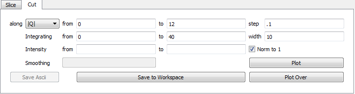

Taking Cuts
===========
    This page provides a more detailed explanation on taking cuts in MSlice

From the GUI
------------
The cut tab will by default be diabled. When you click on a cuttable workspace it will be enabled.

**To plot a Single Cut**

1. Click on a projection workspace in the *Workspace Manager* to select it.

2. Switch to Cut tab

3. Fill in the mandatory values for the integration axis and the integration range

.. image:: images/cutting/mandatory_values.png

4. Optionally Specify the range for the intensity to shown and tick the the `Norm to 1` checkbox to normalize the
   cuts to 1.

5. Click on the **Plot** button to plot the cut.

.. image:: images/cutting/single_cut.png

**To Plot Multiple Equal From one workspace**

1. Click on a projection workspace in the *Workspace Manager* to select it.

2. Switch to Cut tab

3. Fill in the mandatory values for the integration axis and the integration range

4. Specify the `width` parameter. When the the width parameter is set then cuts the values in `integration from` and
    `Integration to ` will specify the range of the data to processed. The range specified will be divided into sections of
    `width` and each section plotted individual. For instance setting the integration from `0` to `40` with width `10` will produce
    4 individual cuts, one with the ranges : from 0 to 10, from 10 to 20, from 20 to 30, from 30 to 40.

4. Optionally Specify the range for the intensity to shown and tick the the `Norm to 1` checkbox to normalize the
   cuts to 1.

5. Click on the **Plot** button to plot the cut.

.. image:: images/cutting/width_cuts.png

**To add cuts to an existing plot**
1. Click on a projection workspace in the *Workspace Manager* to select it.

2. Switch to Cut tab

3. Fill in cut parameters (You can specify width to add multiple cuts to a plot at once).

4. Make sure the cut window you you want to plot is the current cut window (if it is not click on the make current button
   on it).

5. Click on the **Plot Over** button to add the cut to the plot.

.. image:: images/cutting/multiple_cuts_in_one_window.png

N.B. If you plot multiple cuts to the same window (using **plot over** or **width**) and ``Norm to One``  each cut will
still be normalized independently (e.g. The ratio between corresponding points on  the different cuts will not be conserved).

**Save cuts to workspaces**

1. Click on a projection workspace in the *Workspace Manager* to select it.

2. Switch to Cut tab

3. Fill in cut parameters (You can specify width to add multiple cuts to a plot at once).

4. Click on the **Save to workspaces** button to add the cut to the plot.

5. The new cuts should now appear in the **Workspace Manager**

.. image:: images/cutting/cuts_saved_to_workspace.png

**Interacting with saved cuts**

  Clicking on a saved cut will make the cut tab show the parameters the cut was taken with.

  .. image:: images/cutting/cut_tab_show_params.png

  You cannot edit these values, However, you still can set an intensity range for the plot. If the cut was not normalized
  to one then you can normalized it if you wish. You cannot revert a normalized cut to its previous state

  To plot the cut click on **Plot**/**Plot Over** or alternatively to save the cut to a workspace click on the **Save**
  button in the **Workspace Manager**
