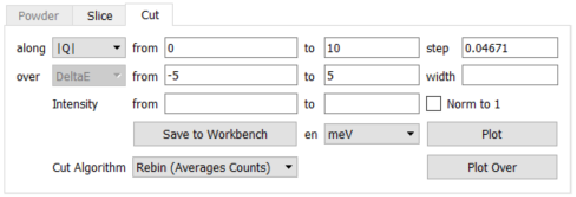
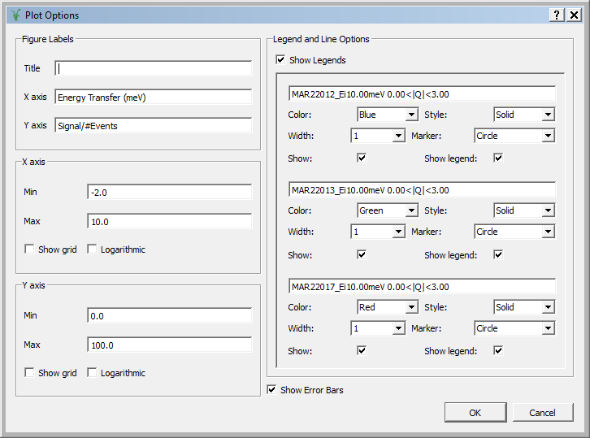
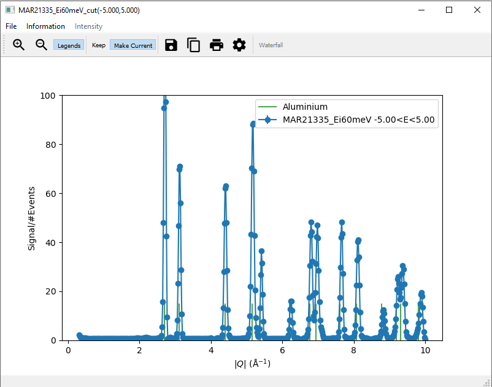

Taking Cuts
===========

This page provides a more detailed explanation on taking cuts in MSlice.

.. _Cutting_from_the_GUI:

Cutting from the GUI
--------------------

The cut tab will be disabled by default, and enabled when you click on a cuttable workspace. This is either a loaded
**non-PSD** dataset (see :ref:`PSD_and_non-PSD_modes`), or a **PSD** dataset for which you have done a ``Calculate
Projection`` (converted to an ``MD Event`` type workspace).

To plot a single cut, fill in values for the cut axis, labelled ``along``, its limits (``from`` and ``to``), and the step
size. For **non-PSD** datasets you also have to select the axes ``over`` which to integrate, and the integration range.
One of the cut or integration axis must be *energy transfer* in this case. For a **PSD** dataset, the ``Calculate Projection``
step specifies the two axes already. The axis which is not selected to plot ``along`` is implicitly used as the integration
axis.

If you type ``0`` in or leave the ``step`` input box empty, the default step size, determined from the data will be used.
You must specify values for the cut limits and integration range, however.

Multiple cuts can be plotted from the same dataset simultaneously by specifying an integration ``width``. This will produce
cuts between the specified integration minimum and maximum with the specified width, with the last cut being the remainder.
For example, if ``from`` is ``0`` and ``to`` is ``10`` and ``width`` is ``3``, clicking ``Plot`` will overplot 4 cuts which
integrate over [0,3], [3,6], [6,9] and [9,10] respectively.

Cuts with the same range from multiple datasets can be plotted by first selecting multiple workspaces in the left panel.

There are two different methods to compute cuts: ``Rebin`` and ``Integration``.
**NOTE: for mantid major releases from** ``v6.40``\ **, the default cutting algorithm has been changed from** ``Rebin``
**to** ``Integration``\ **. For more detail on this change, and cutting algorithms in general, see the** *Cutting Algorithms*
**section below**.

Clicking on the ``Norm to 1`` check box will cause the resulting cut data to be normalised such that the maximum of the data
of each cut is unity.

The ``Plot Over`` button allows you to overplot data on the same figure window without first clearing the current data. Note
that no check is made about whether the cuts makes sense (e.g. it is possible to plot a *Q* cut over an energy cut or vice
versa).

Finally, the cut figures have the same ``Keep`` / ``Make Current`` window management system introduced in the original
Matlab MSlice as the slices. Clicking ``Plot`` will send data to the **Current** figure window, clearing whatever was
previously plotted there. Clicking ``Plot Over`` sends data to the **Current** figure window but plotting over data already
there. If you wish to have a fresh plot but to keep the data in a particular plot figure window, click ``Keep``. To make
a **Kept** figure **Current** again (for example to use ``Plot Over``), click ``Make Current``.
See :ref:`Keep_/_Make_Current` for more details.

You can edit the axes limits, scale and titles by double-clicking on the relevant axis in the plot window. Clicking on each
plot line will also allow you to change its colour and symbol. These functionalities are also accessible from the options
button (the cog symbol) in the plot figure toolbar.

Overplotting powder lines
------------------------------------

To help with a "first look" data analysis, *MSlice* can overplot on the cuts the positions of powder reflections from common
sample environment materials (Aluminium, Copper, Niobium and Tantalum). These functionalities may be accessed from the
``Information`` menu option as shown above.

Powder reflections from an arbitrary crystallographic information format (CIF) file can also be
plotted but note that we use the `PyCifRW <https://pypi.python.org/pypi/PyCifRW/4.3>`_ package to read CIF files and that
some files generated by FullProf or GSAS may not be readable. In these cases, please load the files in `Vesta
<http://jp-minerals.org/vesta/en>`_ or `OpenBabel <http://openbabel.org>`_ and resave them.

Saving cuts
-----------

Each time you click ``Plot`` or ``Plot Over`` an ``MD Histo`` type workspace is created, and can be accessed from the
corresponding tab. This workspace can be saved to Nexus (``nxs``), Matlab (``mat``) or ASCII (``txt`` or ``xye``) formats.
*MSlice* is able to load previously saved Nexus or ASCII cuts from file, but you may only then plot or overplot these cuts
(further manipulation of the cuts is not allowed, although you may normalise the intensity to unity for the plots).
The ASCII format is a simple three column ``x`` - ``y`` - ``e`` type format. For ``mat`` files, three vectors ``x``
(coordinate), ``y`` (signal) and ``e`` (uncertainties) are saved.

From the plot figure window, you can also save the workspace data to the same formats (``nxs``, ``mat`` and ``txt``). In
addition you can also save the figure as an image, either in ``png`` or ``pdf`` formats.

In order to save a cut from an :ref:`Interactive_Cuts`, you can click the ``Save`` icon (floppy disk) direct on the cut
window, or first click the ``Save Cut to Workspace`` button to create an ``MD Histo`` type workspace and then use the ``Save`` button on
that tab.

When MSlice is used as a Mantid interface ``MD Histo`` type workspaces can also be saved to Mantid Workbench by clicking the
``Save to Workbench`` button either on the ``MD Histo`` or the ``Cut`` tab.

.. _Cutting_Algorithms:

Cutting Algorithms
------------------

There are two different methods used to compute cuts:

- ``Integration`` sums the (signal :math:`\times` bin width) in the integration range.
- ``Rebin`` averages the signal in the integration range.

The two methods are described in more detail in the :ref:`Mathematical_Reference`,
but in short, there is a bin-dependent conversion factor between the two types of
cuts which depends on the data coverage in the integration range of that bin.
That is, if the integration range does not include regions without data
(e.g. due to kinematic constraints), then the two cuts will be equivalent except
for a constant scaling factor (proportional to the integration range).
However, if the integration range overlaps regions without data,
then the two cuts will give markedly different results.

The default method is ``Rebin`` and is more suitable for DOS-types cuts which
integrate over :math:`|Q|` whilst if you are interested in cross-sections and
are integrating over energy transfer, it is recommended to use ``Integration``.

There is an option in the ``Cut`` tab to change the cut algorithm from ``Rebin``
to ``Integration`` or vice versa and this setting will be saved for subsequent
similar cuts on the same workspace.

You can also change the default using the ``Options`` menu, ``Cut algorithm default``
entry. This will change the default cut algorithm *for this session of MSlice*
(the default algorithm will revert to ``Rebin`` if you restart MSlice).

..
  For mantid major releases from ``v6.40``, the default cutting algorithm has been changed from ``Rebin`` to ``Integration``. This change
  has been made because the ``Integration`` method can be used for both absolute and non-absolute units measurements. Conversely, for
  absolute units measurements the ``Rebin`` method will give incorrect and misleading values.
  As a result of this change, it is expected that values calculanced henceforth will differ from those calculated historically, if the
  default integration method has been used.
