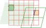
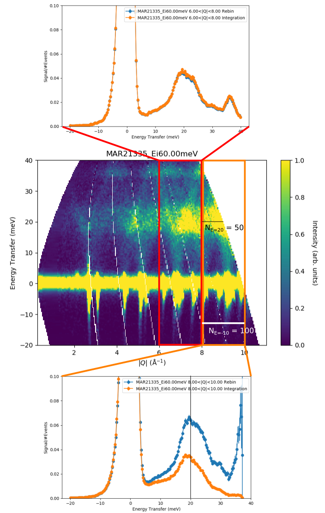

.. _Mathematical_Reference:

Mathematical Reference
======================

This page describes the mathematical operations behind the ``Slice`` and ``Cut`` operations of MSlice

In general, MSlice handles "reduced" (processed) inelastic neutron scattering data which has been
binned (histogrammed) in energy transfer for each detector / position-sensitive-detector (PSD) element.
We will use the terminology of the `Horace <https://pace-neutrons.github.io/Horace>`_ program and
refer to these energy-detector-element bins as "pixels".

Since the detector elements are in the laboratory coordinates, but we often want to plot the data
in reciprocal space, a coordinate transformation is needed.
This means that the input and output binning grids of the data will not be axis aligned, and will
instead look something like this:

Where the square red grid represents the target (output) bins, and the slanted green grids
(parallelograms) represents the original bins ("pixels").
As discussed in the :ref:`PSD_and_non-PSD_modes` section, MSlice makes a distinction between
**PSD** (fine green grid) and **non-PSD** (coarser green grid) data.

``Slice`` refers to a rebin into a two dimensional output, whilst ``Cut`` refers to a rebin _or_
integration into a one dimensional output.
For each type of data (**PSD** and **non-PSD**) we will describe each operation in turn.

PSD Slice
---------

For **PSD** data, MSlice uses *centre-point rebinning*, treating each input bin ("pixel") as a
point and summing the full signal of each pixel whose centres lie within an output bin
(illustrated in the image by the darker green shading in top left).
Thus the output signal in the :math:`(i,j)`\ th bin, :math:`Y_{ij}`, is:

.. math::
    Y_{ij} = \frac{1}{N_{kl}} \sum_{kl} y_{kl}

where :math:`y_{kl}` is the input signal in the input :math:`(k,l)`\ th bin
and the sum runs over the :math:`N_{kl}` number of bins whoses centres lie within the
boundaries of the :math:`(i,j)`\ th output bin.

The above expression uses the ``NumEventsNormalization`` convention of Mantid which is the
same as that adopted by the `Horace <https://pace-neutrons.github.io/Horace>`_ program.
The error values are considered to be standard deviations and are summed in quadrature.

PSD Cut
-------

Since MSlice allows users to specify bins in the non-integrating direction which are not
necessarily aligned with respect to the original data, a rebinning step as described above
is needed for the ``Cut`` operation too.

This leads to the two types of behaviour ("algorithms") for the ``Cut`` operation described
in the :ref:`Cutting_Algorithms` section:

- The default ``Rebin`` method just uses the rebinning described above with one axis having
  only a single bin.
- The ``Integration`` method first rebins the data as described above with integration axis
  divided into :math:`N_{\mathrm{int}} =` 100 bins.
  It then calls the relevant Mantid algorithm
  (`IntegrateMDHistoWorkspace <https://docs.mantidproject.org/nightly/algorithms/IntegrateMDHistoWorkspace-v1.html>`_\ )
  to integrate (sums the signal) in those 100 bins.

Taking the :math:`j` index to be over the integration axis, the integrated ``Cut`` signal
:math:`C_i` is then given by:

.. math::
    C_i^{\mathrm{integration}} = w_i \sum_{j \in \mathcal{D}} Y_{ij}

where the index :math:`j` only runs over regions with data :math:`\mathcal{D}`, and the width
:math:`w_i = \sum_{j \in \mathcal{D}} w_{ij}` where :math:`w_{ij}` is the width in the
:math:`j`\ th direction of the :math:`(i,j)`\ th bin.

Note that the equivalent expression for a ``Rebin`` cut is simply:

.. math::
    C_i^{\mathrm{rebin}} = \sum_{j \in \mathcal{F}} Y_{ij}

where now the index :math:`j` runs over the full integration range :math:`\mathcal{F}`.
The difference is thus a coordinate-dependent weighting factor :math:`w_i`.
If the integration range *does not include regions without data* (e.g. :math:`\mathcal{D} \equiv \mathcal{F}`)
then all the :math:`w_i` will be equal to the full integration width and the difference between
:math:`C_i^{\mathrm{integration}}` and :math:`C_i^{\mathrm{rebin}}` is a constant.

However, if the integration range covers region with no data (e.g. beyond the kinematic limits)
then the two cuts *may* look very different because :math:`C_i^{\mathrm{integration}}` will weight
regions with more data more heavily than regions without data.

Non-PSD Slice
-------------

For **non-PSD** data, MSlice uses *fractional rebinning*, where it first calculates the
overlap area between the input and output bins, and then sums only the fractions of the
signal of the input bins within the output bin (darker green shading in bottom right).

The output signal is computed as:

.. math::
    Y_{ij} = \left. \sum_{kl} y_{kl} f_{kl} \right/ \sum_{kl} f_{kl}

and the output uncertainty as:

.. math::
    E_{ij} = \left. \sqrt{\sum_{kl} e^2_{kl} f_{kl}} \right/ \sum_{kl} f_{kl}

where :math:`f_{kl}` is the fractional overlap of the input :math:`(k,l)`\ th bin with
the output :math:`(i,j)`\ th bin.

This is illustrated in the image at the start of the page by the square on the right
hand side with blue triangular and orange quadrilateral shaded regions.
The blue and orange shading illustrates the fractional overlap areas which weights
the signal in the top left and top right input bins (large parallelograms).

Non-PSD Cuts
------------

Like for **PSD** data, there are two ``Cut`` "algorithms" for **non-PSD** data also.

The ``Rebin`` cut algorithm performs the same operation described in the previous section
but with a single bin in the integration axis, yielding

.. math::
    C_i^{\mathrm{rebin}} = \left. \sum_{j \in \mathcal{F}} Y_{ij} \right/ \sum_{j \in \mathcal{F}} F_{ij}

where :math:`F_{ij} = \sum_{kl} f_{kl}`, and :math:`\mathcal{F}` indicates the full integration range.

In order to support rebinning in the non-integration axis, the ``Integration`` algorithm
first rebins the data into the desired bins in the non-integration axis,
and 100 bins in the integration axis and then sums them as:

.. math::
    C_i^{\mathrm{integration}} = \left. N_i \sum_{j \in \mathcal{F}} Y_{ij} w_{ij} \right/ \sum_{j \in \mathcal{F}} F_{ij}

where :math:`N_i = \sum_{j \in \mathcal{D}} 1` is the number of :math:`j` bins at a given
:math:`i` with non-zero fraction (e.g. if the integration contains only regions with data
then :math:`N_i` = 100, otherwise :math:`N_i` will be less),
and :math:`w_{ij}` is the width along the :math:`j`\ th axis of the :math:`(i,j)`\ th bin.
The :math:`N_i` normalisation is needed because in the limiting case where all the fractions
:math:`F_i` are unity, the denominator would be :math:`N_i`, so we recover the usual
expression for integrating over a distribution.
Note that as previously, :math:`\mathcal{D}` indicates the region within the integration
range with non-zero fractions.

Like with the **PSD** case there is thus an :math:`i` dependent scaling factor :math:`N_i w`
(assuming all the bins have the same width) between ``Cuts`` computed using the ``Rebin`` or
``Integration`` algorithm.
This scaling factor is a constant if the integration range includes only regions with data
(e.g. :math:`\mathcal{D} \equiv \mathcal{F}`), but will not be constant if the integration
overlaps regions without data.

The difference is illustrated below:

The cuts have been normalised to the peak intensity so that the constant scaling factor between
the two algorithms factorises out.
In the top cut, integrating over :math:`6 \leq |Q| < 8 \mathrm{\AA}^{-1}` there are no regions
without data so the two cuts are equivalent except for a constant scaling factor.
In the bottom cut, integrating over :math:`8 \leq |Q| < 10 \mathrm{\AA}^{-1}` there is a large
region with no data, so now cuts from the two techniques differ markedly.
At :math:`E<0` meV Where the data covers the full integration range, we have :math:`N_i` = 100
and the two cuts are equivalent.
As :math:`E` increases, :math:`N_i` decreases until at around 20 meV, it is :math:`N_i` = 50,
and we see that at that point the (normalised) ``Integration`` cut is half the intensity of
the (normalised) ``Rebin`` cut.

A note on units
---------------

One advantage of inelastic neutron scattering over other techniques is that it is (relatively)
easy to normalise the measured data to absolute units.
At the ISIS Neutron and Muon Source if this normalisation is done, then the signal will be in
units of [milibarns per steradian per meV per formula unit] or [mb/sr/meV/f.u.].

An ``Integration`` over energy would then yield a differential cross-section in [mb/sr/f.u.],
whereas a ``Rebin`` over energy would leave the units unchanged at [mb/sr/meV/f.u.].

However, an ``Integration`` over :math:`|Q|` instead of energy will yield units of
[mb/Å/sr/meV/f.u.] rather [mb/meV/f.u.] and as such it may be more useful to perform an
average ``Rebin`` which will leave the units unchanged.

Unfortunately, the input files read by MSlice do not indicate if the signal values saved
are in absolute units or not, so MSlice cannot automatically write the correct units to axes
- this is left to the user.

A note on the regions of validity of the two algorithms
-------------------------------------------------------

As can be seen in the example above, the ``Integration`` cut algorithm will produce low signals
where there is less data, whereas the ``Rebin`` cut algorithm will amplify the signals in such
regions - effectively assuming that the signal is constant across the integration range and
thus extrapolating over regions without data (so the only manifestation of the lack of data
are larger errorbars associated with these bins).

This assumption *may* be valid for density-of-states (DOS) type cuts where one would expect
that the signal is approximately constant over :math:`|Q|` and only varies in energy.
Thus for these applications, it may be suitable to chose the ``Rebin`` algorithm, and to
extrapolate the high-energy, high-:math:`|Q|` regions which are kinematically inaccessible.

Conversely, for integration over energy - for example over the elastic line to compute a
differential cross-section or over a finite energy crystal field excitation to obtain a
magnetic cross-section, the ``Integration`` algorithm should be chosen else the signal
in the cut will vary with the integration range and would not be a cross-section.
