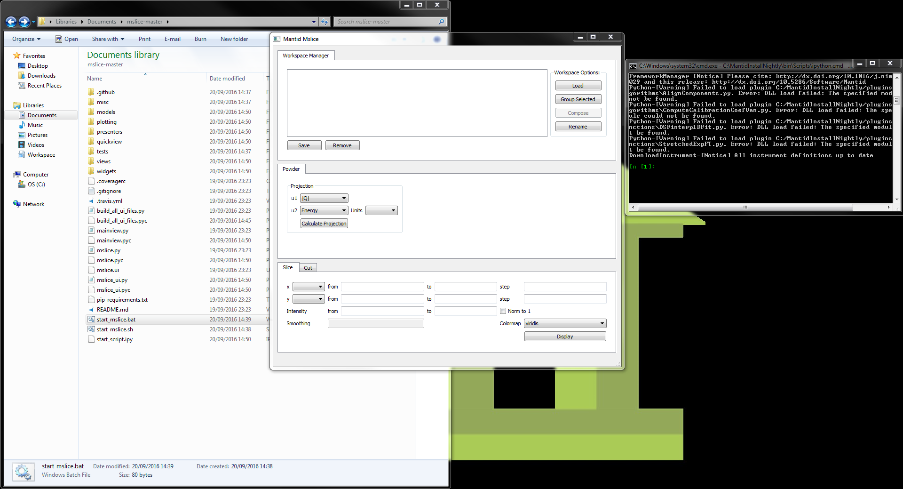
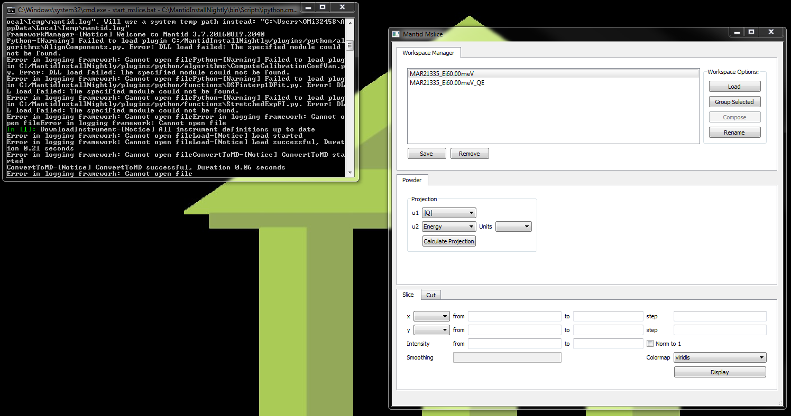
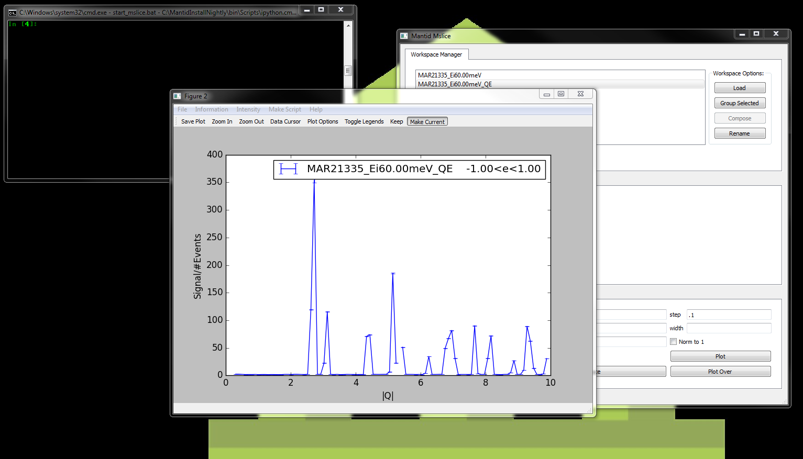

Quick Start
===========
This Quick start tutorial will walk you through the basics of loading a file, calculating the projections, plotting a slice
and plotting a cut

1. To install MSlice download this `zip <https://github.com/mantidproject/mslice/archive/master.zip>`_ archive and
   extract(unzip) the archive to a folder on your computer.

2. Open the folder you extracted the archive to. Inside it there should now be a folder named ``mslice-master`` open that
   folder.

3. Run the start-up file by double clicking it. For windows users the start-up file is ``start-mslice.bat`` , for linux
   users the start-up file is ``start-mslice.sh``

5. Two windows will shortly appear on the screen. One should be a console window, the other one should be MSlice interface

5. Click on the **Load** button and select a file to load into `MSlice` . After the file loads a new entry should appear
   in the workspace manager.

.. image:: images/quickstart/workspace_loaded.png

6. If the loaded workspace is a `Workspace2D` then you must calculate the projections before being able to take slices or cuts
   If it is an `MDWorkspace` Then you can skip the next step.

7. To calculate the projections for a workspace first select the workspace by clicking on it in the `Workspace Manager`.
   After selecting the workspace you can set the projections parameters in the `Powder` tab. After setting the paramenters
   click on the **Calculate Projection** button. A new workspace should appear in the `Workspace Manager`.

  N.B. Currently `MSlice` only supports projecting to `|Q| vs Energy` or `Energy vs |Q|`

8. Select the new projection workspace by clicking on it. The input boxes in the **Slice** tab should automatically be
   filled by suggested values calculated from the workspace. If you want to edit the `Slice` parameters before plotting
   then do so now.

.. image:: images/quickstart/slice_parameters.png

9. To plot the slice click the **Display** button in the `Slice` tab. A new window containing the plot should appear.

.. image:: images/quickstart/slice_plotted.png

10. You can close the slice plot window, minimize it or keep it open before continuing.

11. If the projection created earlier is not selected (if it is selected it will be highlighted) then select it by
    Clicking on it.

12. To plot a a cut open the cut tab. Fill in the desired cut parameters. Leave the width parameter empty for now. Click
on the **Plot** button. A new window with the cut should now appear.

