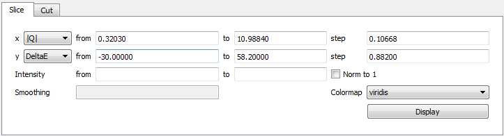

Slicing
=======

This page provides a more in depth explanation of slicing in MSlice.

From The GUI
------------

#. Click on a projection workspace in the **Workspace Manager** to select it.When a sliceable *Workspace* is selected
    in the **Workspace Manager** tab the **Slice** tab is automatically populated with suggested values.

#. After changing the parameters as desired click on the display button.

From the  Command Line
----------------------

 *<Docstrings from cli.get_slice and cli.plot_slice should go here>*

Example
-------

First lets load some data and get the projections ready.

.. testcode::

   import cli
   ws = cli.Load('MAR21335_Ei60.00meV.nxs')
   projection = cli.get_projection(ws, '|Q|', 'DelatE')

Plotting a simple slice that spans all of the data

..  testcode::

   cli.plot_slice(projection)

Specifying the axis

.. testcode::

   cli.plot_slice(projection, '|Q|', 'DeltaE')

Specifying the axis with binning parameters,

.. testcode::

   cli.plot_slice(projection, '|Q|,0,10,.5', 'DeltaE,-20,20,1')

Specifiying the binning parameters for a single axis

.. testcode::

   cli.plot_slice(projection, '|Q|', 'DeltaE,-20,20,100')

Specifying the intensity range

.. testcode::

   cli.plot_slice(projection, '|Q|,0,10,.1', 'DeltaE,-20,20,.5', intensity_min=.2, intensity_max=1)

Normalizing the intensity

.. testcode::

   cli.plot_slice(projection, '|Q|,0,10,.1', 'DeltaE,-20,20,.5', normalize=True)

Setting the colormap
    Any valid matplotib colormap object or colormap name maybe passed a a value of the ``colormap`` parameter in
    ``plot_slice``

.. testcode::

    cli.plot_slice(projection, colormap='coolwarm')

